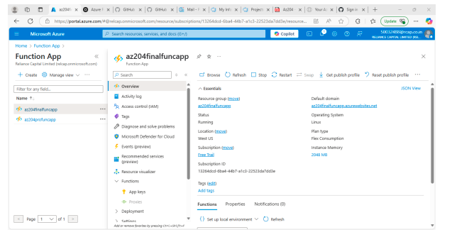
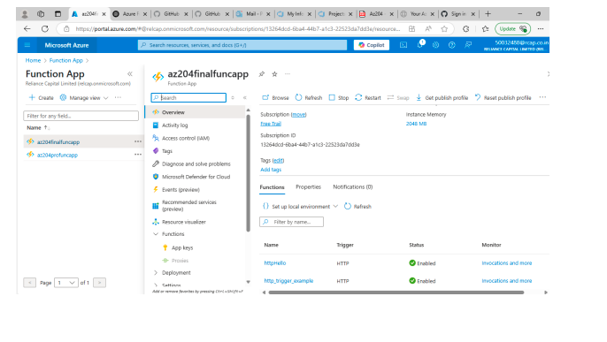
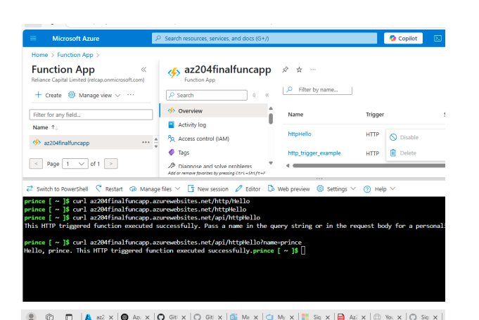
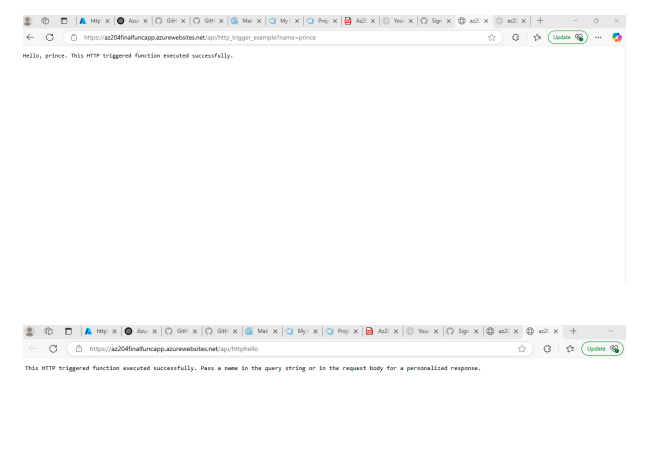

# Azure Function with Python – HTTP Trigger (AZ-204 Project 1)

## 🚀 Overview

This project demonstrates how to build a serverless function in Microsoft Azure using **Azure Functions with Python**. The function is triggered by HTTP requests and returns a simple response. It simulates how Skill-Up Online would begin exploring serverless architecture for cloud-based APIs.

## 🧰 Tools & Technologies

- Azure Functions (Python)
- Azure Resource Manager
- Azure Portal
- HTTP Trigger
- curl / Test/Run Feature

## 🔄 Project Tasks

1. Created a **resource group** named `AZ204-Project1-RG` in the **West US** region.
2. Created an **Azure Function App** using:
   - Python runtime
   - HTTP trigger
3. Implemented Python code that returns:
Hello, Azure!
for every incoming HTTP request.
4. **Tested the function** using:
- `curl` command in the terminal
- Azure Portal’s “Test/Run” feature
5. **Validated** that each HTTP request returned `"Hello, Azure!"` successfully.

  📸 Screenshots
Azure Function Overview

Code Added in Azure

Function Test Result (Response: Hello, Prince)

✅ Outcome
Successfully deployed an Azure Function using Python.

Responded to HTTP requests with “Hello, Azure!”.

Validated via both the Azure Portal and CLI (curl).

📚 What I Learned
How to create and deploy Python Azure Functions

How to handle HTTP triggers in serverless apps

How to test and validate serverless endpoints
